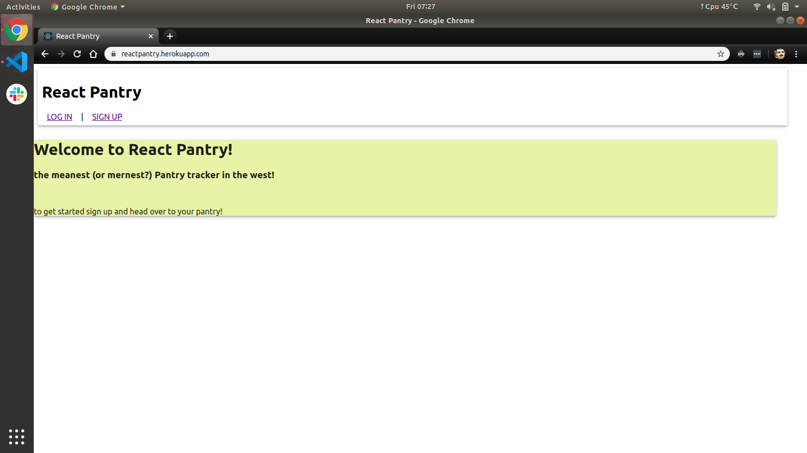
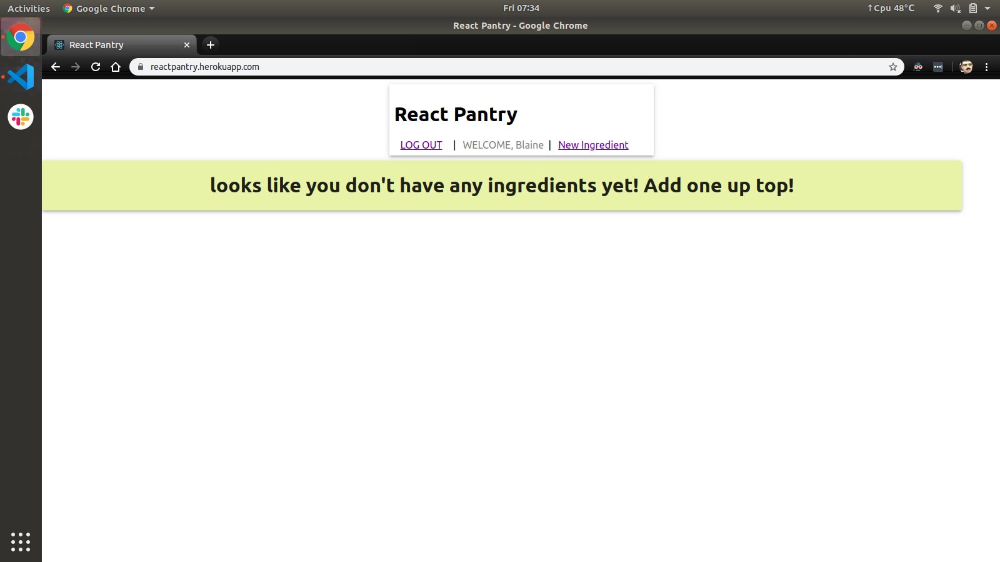
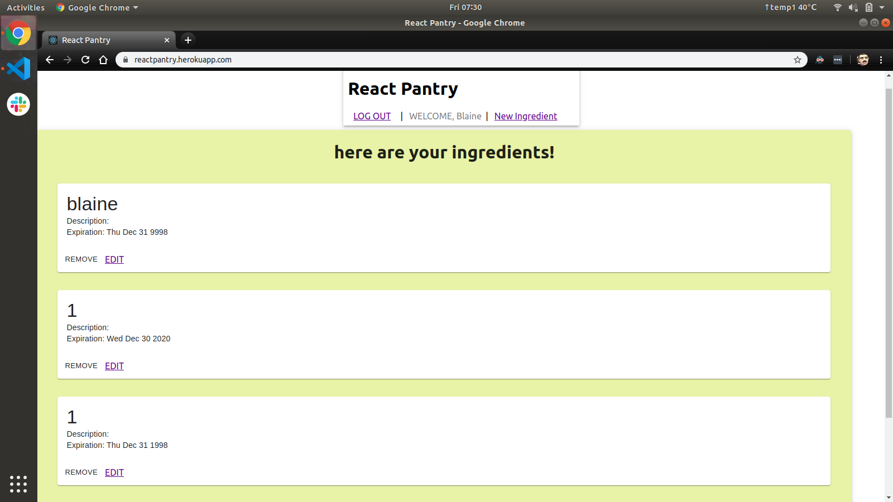

# <b>Sudoku</b>  a Web Based Implementaion

## Overview

<b>React Pantry </b> The MEANest (or should I say MERNest Pantry tracker in the west)
  

when you first open the app it should look like such

once you sign up or login you can start adding ingredients to your pantry 

As you add ingredients to your pantry they are shown below

## Technologies

For this project I used the full mern stack (Mongoose, Express, React, Node)  

## Getting Started

you'll first want to find your way on over to https://reactpantry.herokuapp.com/ then just follow the steps listed above and get your pantry on!

# What's Next!

Still a lot of work left to do on this project. 
 - In some spare time I'd like to add: 

    ☐ Styling of expired ingredients

	☐ Recipe API integration to give you some ideas to make with all that weird stuff in your pantry

	☐ even cleaner styling

	☐ promotion of the end product